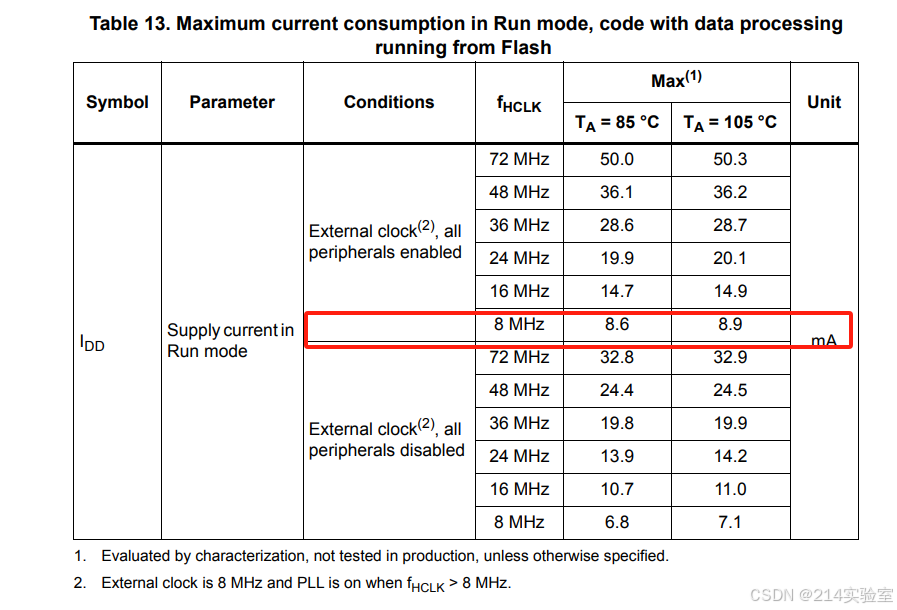
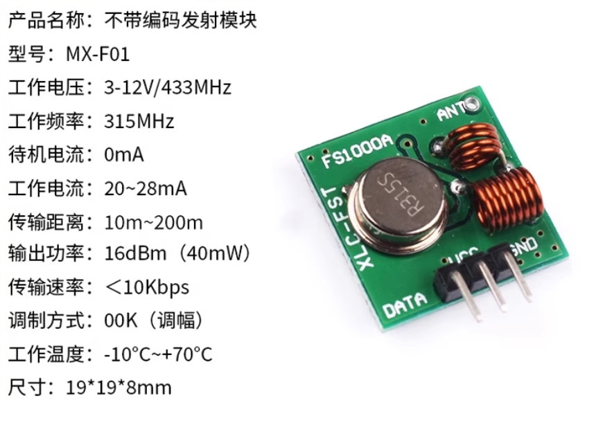
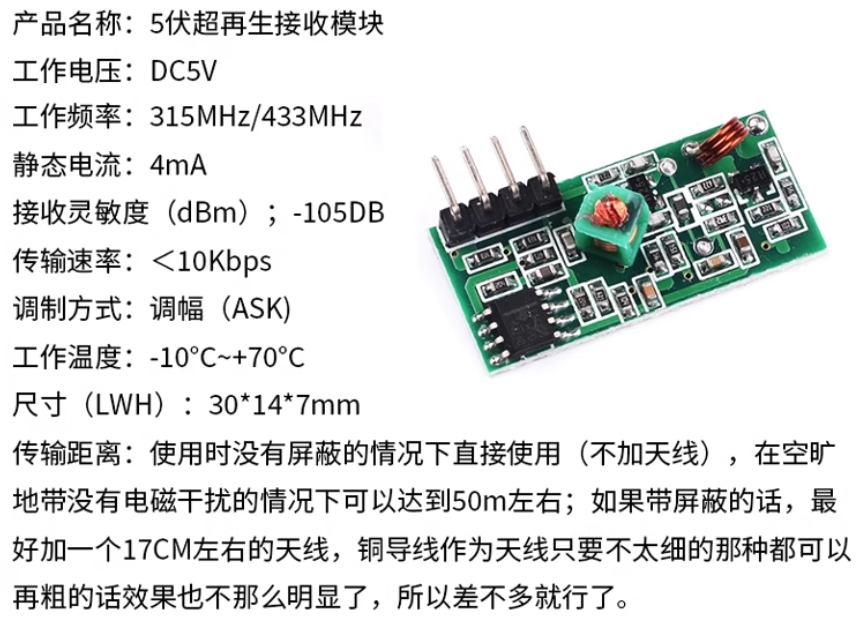

# 无线遥控433发射与接收开发日志

## 2025.10.07

- 元器件选取：1、LDO选择UMW(友台半导体)的HT7333-A（封装：SOT-89-3）输入电压范围最大输入12V，输出3V3（250ma），功耗3ua（选取理由：STM32F103需要根据实际评估，理论最大150ma，IO引脚耐电流为25mA，实际可参考下表；[关于STM32F103、PIC32系列单片机工作电流与功耗的整理](https://blog.csdn.net/GFGFGFI/article/details/142391596)，发射模块选取[315/433MHZ超再生无线收发模块315M433M带解码接收发射遥控模块](https://detail.tmall.com/item.htm?abbucket=8&id=615405552705&ns=1&pisk=gGyQTzjyHeYIep_usyjZf0BVe1H5dGW2R3i8mupe2vHKy5Z0P2SltvPsPPUsJpShtb37-vhuT4uEPYZulG7V3tr3xYcRuZWV6UaskxY-yLLrWFnjFDBCQ1SLxYDRPhJRgtZ3kGQCNwm-XGirVHLLyXE9Bm0t2DdLyVhtDm8KezCdPCUrqYlzE4fGVrzI83Vzahnaiu3UYQ7oW547pQJhyBm-ykZ2qDnLTNsg-VppJLdp6dnnq4H-2XptX0mX9BhJplptS0H-yzHRffh2zpiwO2ECvnuiDZ7mBk36eLedEXgj-QJWF-nKO8Et5lraCDGIlfTetayL7ueUKffHTYqaGzN8rsRiduFKpmrhddMYv5ySb8SyN2EaCleSt3dLf8gIMJh6VKZsp0U-N5bX3DMU1jwQtgYTvruQMvqycwrsG5GmXfKW9vP408cYp9Tm7jm78VzAHdMtwgzy3q6AXQtsiLisuGs6ZQvcRLLl4meBsXnibaS1fe1o9cmsuGs6ZQcKjcyRfGTCZ&priceTId=undefined&skuId=4509111594133&spm=a21n57.1.hoverItem.9&utparam=%7B%22aplus_abtest%22%3A%22ecf8e20417ba75527a78d0d084982268%22%7D&xxc=taobaoSearch)中的433发射模块）；2、433发射模块选取`超再生无线发射模块`
- 
- 
- 

## 2025.10.06

- 设计流程思路：产品功能需求分析、嵌入式软硬件开发设计框图、结构设计框图、配套软件。
- 设计框图：1、设计框图文档已整理为word格式，详细参照`\Doc\设计需求及功能\设计需求及功能.docx`；2、绘制框图软件有Draw.io和Visio，其中Draw.io是GitHub上一个开源的流程图绘制工具，功能很丰富，Visio是word文档常用，且可以用于GitHub，考虑到后续方便word、PPT使用方便，特选择Visio绘制流程图插图；3、。
- STM32选型：1、STM32F103C8T6_LQFP-48(7x7)、STM32F030K6T6_LQFP-32(7x7)、STM32F030F4P6TR_TSSOP-20都可以作为初期嵌入式开发，在此选择STM32F103C8T6_LQFP-48(7x7)；2、STM系列选型参考[STM选型参考](https://www.st.com.cn/zh/microcontrollers-microprocessors/stm32f0x0-value-line.html#tools-software)及嘉立创商城（主要查看国内常用型号，方便后期购买）。
